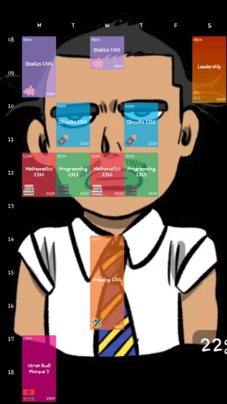
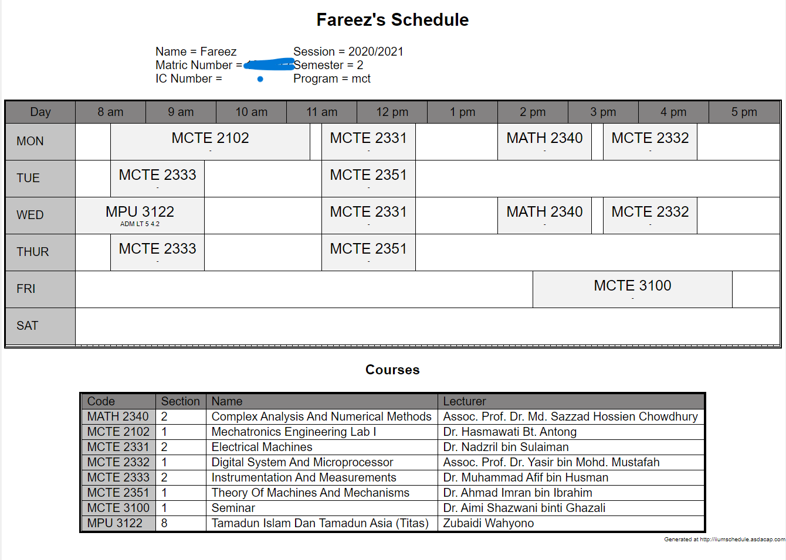

Alhamdulillah ala kulli hal, after about [a year](https://firstcommit.netlify.app/?repo=iqfareez/iium_schedule) of (sporadic) 
development, I'm proud to announce the first stable release of IIUM Schedule app!

> Come seat here, let me tell you a backstory...

Sstudents are familiar [ClassUp](https://classup.plokia.com/) app. ClassUp allow students 
to generate beautiful schedule and allow many customizations. Usually the schedule will be set as lock screen to view
the schedule in a glance.

This is my schedule back in CFS:

I liked it, but to make a new schedule, I had to fill the information manually; the subject name, 
the venue, time and so on. Urghh, is there an easy way to just read my CRS (course confirmation slip) 
and generate a schedule from it?

This is where I stumbled upon [SemiAutomatic Schedule Maker](https://iiumschedule.asdacap.com/schedulemaker/)
by asdacap. It's a great tool, and I've been using it for every semester. The tool allows me to enter the course code and
section number, and it will add to the schedule **together** with lecturer's name, venue, time etc. I immediately loved it.

My schedule while in degree:

However, in my opinion, the **more mainstream** schedule maker among student is ClassUp. Initially I've been looking if
ClassUp has any API that I can use. Unfortunately, I couldn't find any. So, here when I taught of combining both of the 
app concepts into one app; **auto-generate beautiful schedule from i-ma'alum**.

Like my other app, I begin by creating a Flutter project and start developing the UI and basic functionalities. Sometimes the
development stalled due to time constraints _(you know... university stuffs)_, but I tried to keep the development slow and steady. I would like 
to thank [PlashSpeed-Aiman](https://github.com/PlashSpeed-Aiman) for his insights and contributions.

> Okay, I think I've told more than enough. 😂

All in all, **_reaching stable is a milestone, not an end state_**. IIUM Schedule will continue to improve and evolve. 
All I need is your **support and contribution** to make it better. I'd love to hear your [feedback](feedback) & suggestions.
For someone who can code, this project is waiting for your awesome [pull request](https://makeapullrequest.com/). A contribution guideline
will be documented in the [wiki](https://github.com/iqfareez/iium_schedule/wiki).