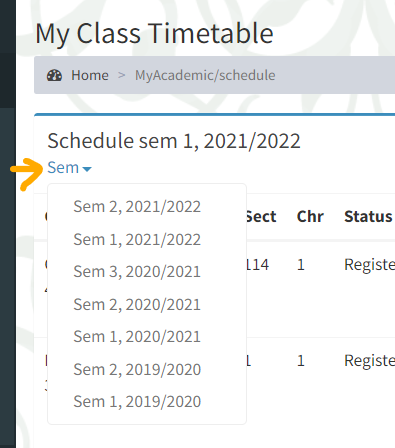
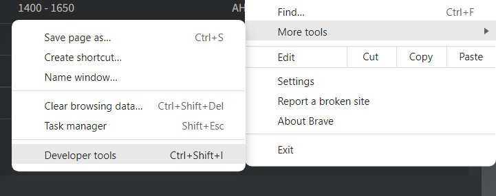
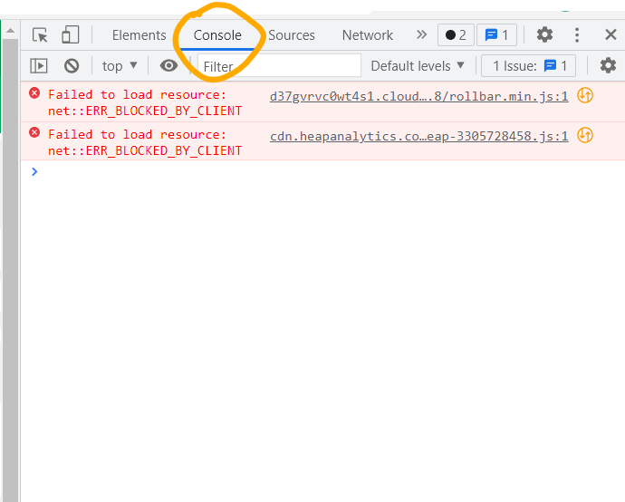
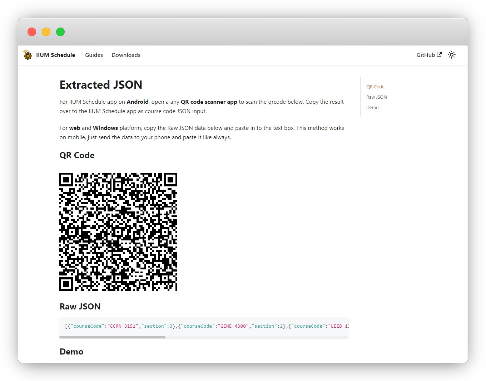
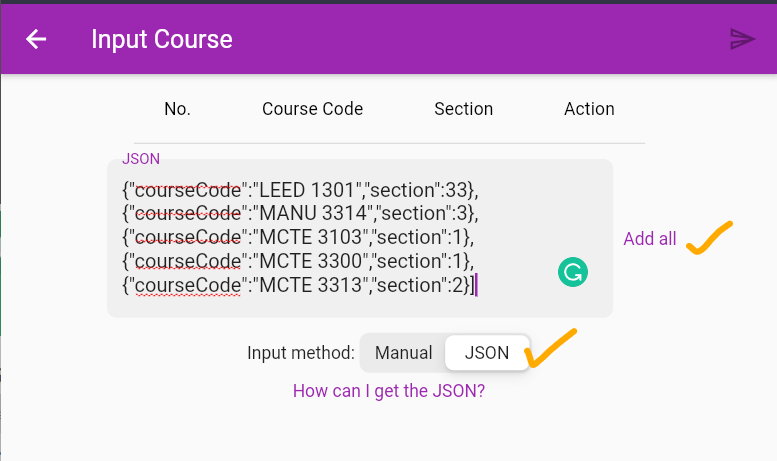

# Extract JSON from i-ma'luum

You are viewing the steps to extract schedule information via **I-ma'luum website**. For prereg, click [here](../prereg/).

:::note

You'll need to access the browser's developer tools to follow this guide. Therefore, **only desktop browsers is supported**.

:::

### 1. Open [i-ma'luum](https://imaluum.iium.edu.my) in desktop browser

and navigate to **My Academic >** [**Class Timetable**](https://imaluum.iium.edu.my/MyAcademic/schedule).

Make sure to select the correct semester. (This should be same semester and session you have set in IIUM Schedule app)



### 2. Open Developer Tools

Press keyboard shortcut <kbd>F12</kbd> or find the **Developer Tools** on your browser.



Then, change to **Console** tab.

:::info

The steps might be different on **Apple Safari**. Kindly follow this [article](https://balsamiq.com/support/faqs/browserconsole/#apple-safari).

:::



### 3. Run script

Next, **copy** the code below and **paste** to the console. Then press <kbd>**Enter**</kbd>.

:::tip

**Firefox** may have paste protection enabled as a security feature. To allow pasting, type `allow pasting` in the console before pasting the code below.

:::

```js
var tableBody = document.getElementsByClassName("table table-hover")[0];
var data = tableBody.getElementsByTagName("tr");

var nullIndex = new Array();
var courseCodes = new Array();
var sections = new Array();
var combinedSubjectDatas = new Array();

// section
for (let i = 1; i < data.length; i++) {
  // add unnecessary rows to unwanted array
  if (data[i].cells[2].getAttribute("rowspan") === null) nullIndex.push(i);
  // only extract the correct rows
  else sections.push(parseInt(data[i].cells[2].innerText));
}

// course code
for (let i = 1; i < data.length; i++) {
  // extract course code except the rows in unwanted array
  if (!nullIndex.includes(i)) courseCodes.push(data[i].cells[0].innerText);
}

// combine code & section
for (i = 0; i < sections.length; i++) {
  combinedSubjectDatas.push({
    courseCode: courseCodes[i],
    section: sections[i],
  });
}

var json = JSON.stringify(combinedSubjectDatas); // data
const myUrl = new URL("https://iiumschedule.iqfareez.com/qrcode");
myUrl.searchParams.append("data", json);
console.log(myUrl.href); // log target url
window.open(myUrl.href); // go to target url
```

The script will scrap the subject course code and its section. After the process completed, another site will be opened to show the QR code and Raw JSON data. Just follow the instruction there.



### 4. Finish

Finally, Paste the JSON result to the app's **JSON input**.


