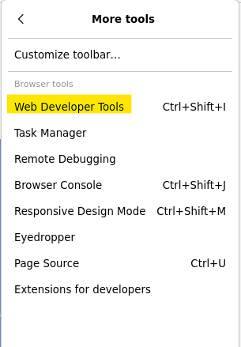

# Extract JSON from Prereg

To extract the required information from i-ma'luum to use in IIUM Schedule, follow the steps below.

:::note

You'll need to access the browser's developer tools to follow this guide. Therefore, **only desktop browsers is supported**.

:::

### 1. Open [prereg](https://prereg1.iium.edu.my) website in desktop browser

and login with your credentials.

:::caution HEADS UP

The prereg site can only be accessed during prereg period.

:::

### 2. Open Developer Tools

Press keyboard shortcut <kbd>F12</kbd> or find the **Developer Tools** on your browser.



Then, change to **Console** tab.


**IMPORTANT!** Set the console execution context to **ora6.php**. The code wil fail to run if this step is missing. Shown below are the examples from Firefox and Chrome.

<details>
  <summary>For Chrome (and other chromium based browser)</summary>
  <div>
  <p>In the console, look for dropdown button that says <b>Top</b>. Then, change it to <b>ora6.php</b> as shown below. </p>
    
  </div>
</details>

<details>
  <summary>For Firefox</summary>
  <div>
  <p>In the console, below the log messages, look for dropdown button that says <b>Top</b>. Then, change it to <b>ora6.php</b> as shown below. </p>
    
  </div>
</details>

### 3. Run script

Next, **copy** the code below and **paste** to the console. Then press <kbd>**Enter**</kbd>.

:::tip

**Firefox** may have paste protection enabled as a security feature. To allow pasting, type `allow pasting` in the console before pasting the code below.

:::

```js
var tableBody = document.querySelector(
  "body > table > tbody > tr:nth-child(2) > td > table > tbody > tr > td > table > tbody"
);

var courseCodes = new Array();
var sections = new Array();
var combinedSubjectDatas = new Array();

var bodyChildren = tableBody.children;

for (let index = 2; index < bodyChildren.length - 1; index++) {
  const element = bodyChildren[index].children;
  const subject = element[1].textContent;
  const section = element[2].textContent;
  courseCodes.push(subject);
  sections.push(section);
}

// combine code & section
for (i = 0; i < sections.length; i++) {
  combinedSubjectDatas.push({
    courseCode: courseCodes[i],
    section: sections[i],
  });
}

var json = JSON.stringify(combinedSubjectDatas);
alert("Copy -----> " + json);
```

You'll see the **JSON result** from the dialog shown. Copy start from `[` and ends with `]`.


For example, you should copy:

```json
[
  { "courseCode": "GENE 4300", "section": "2" },
  { "courseCode": "LEED 1301", "section": "33" },
  { "courseCode": "MANU 3314", "section": "3" },
  { "courseCode": "MCTE 3103", "section": "1" },
  { "courseCode": "MCTE 3300", "section": "1" },
  { "courseCode": "MCTE 3313", "section": "2" }
]
```

### 4. Finish

Finally, Paste the JSON result to the app's **JSON input**.


