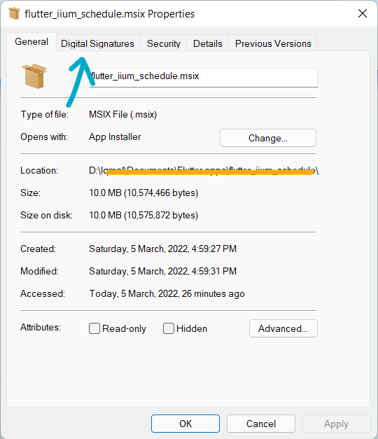
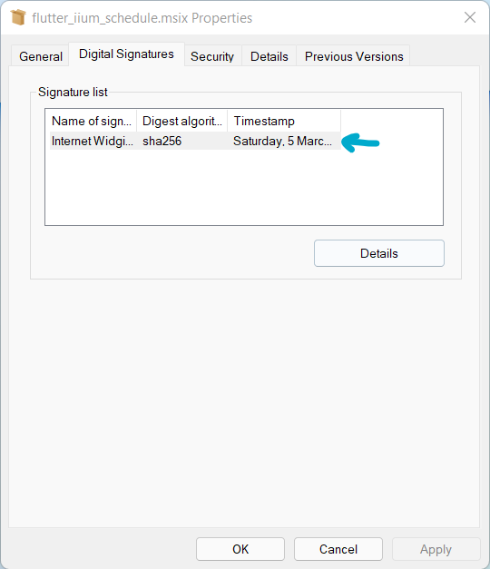
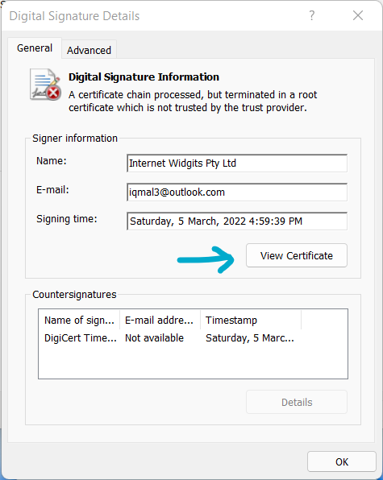
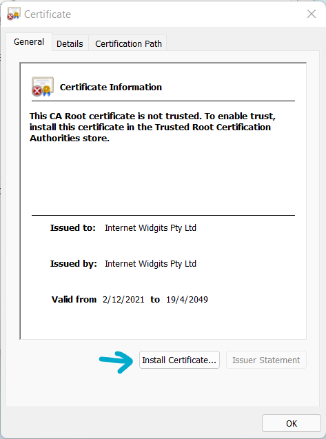
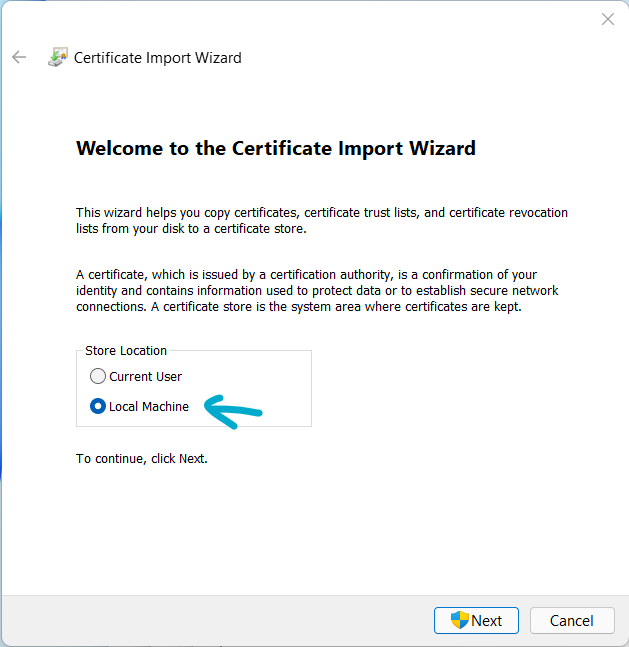

# Install app certificates on Windows

:::info

To run app package that are not coming from Microsoft Store, a certificate need to be installed on the machine beforehands.

:::

Following are the steps to install certificate for IIUM Schedule app.

1. Right click the installer to open **Properties**. Then, go to the **Digital Signatures** tab.

   

2. Double click on the certificate

   

3. Then, click on the <kbd>View Certificate</kbd>

   

4. Click on the <kbd>Install Certificate...</kbd>

   

5. A **Certificate Import Wizard** will pop up. In the store location, change to **Local Machine**.

   

6.
